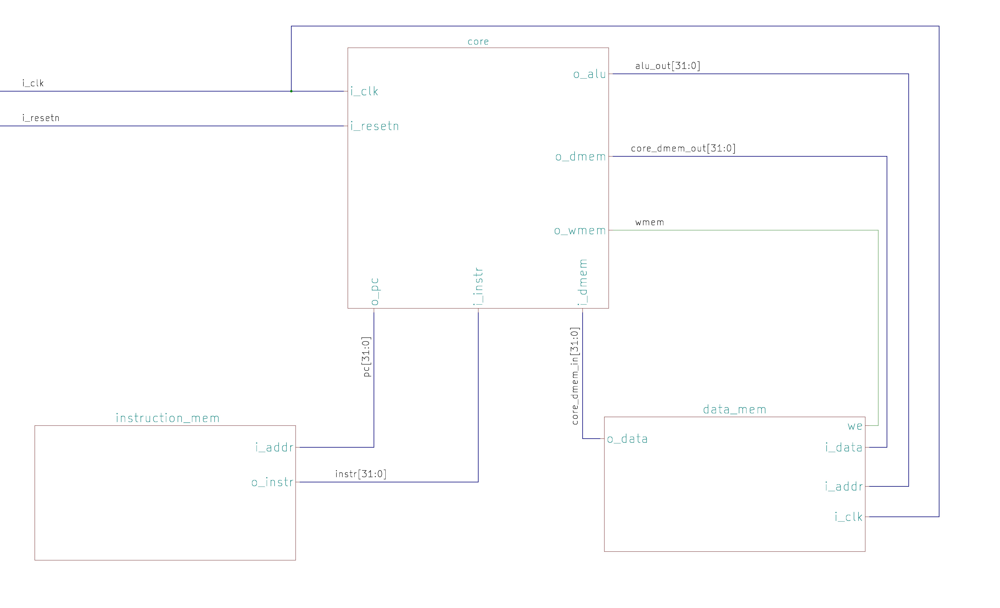
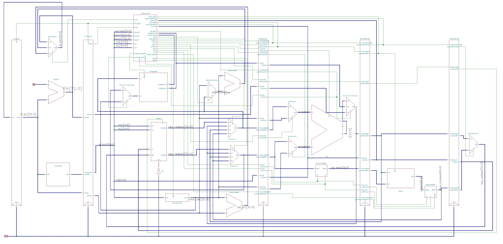

# Single-Cycle-CPU
Simple single-cycle RISC-V CPU

Table of Contents
=================

   * [Directory Structure](#directory-structure)
   * [CPU Design](#cpu-design)
      * [Core](#core)
         * [Program Counter](#program-counter)
         * [Control Unit](#control-unit)
         * [Register File](#register-file)
         * [ALU](#alu)
            * [Add/Sub Unit](#addsub-unit)
               * [Carry Look-ahead Adder (CLA)](#carry-look-ahead-adder-cla)
            * [Shifter](#shifter)
         * [Immediate Decoder](#immediate-decoder)
         * [Store Modifier](#store-modifier)
         * [Load Modifier](#load-modifier)
      * [Instruction Memory](#instruction-memory)
      * [Data Memory](#data-memory)

# Directory Structure
<pre>
├── Core
│   ├── ALU
│   │   ├── AddSubUnit
│   │   │   ├── add_sub32.v
│   │   │   └── CLA
│   │   │       ├── cla_16bit.v
│   │   │       ├── cla_32bit.v
│   │   │       ├── cla_4bit.v
│   │   │       └── cla_8bit.v
│   │   ├── alu.v
│   │   └── Shifter
│   │       └── shifter.v
│   ├── control_unit.v
│   ├── core.v
│   ├── dff.v
│   ├── imm_decode.v
│   ├── load_modifier.v
│   ├── mux.v
│   ├── regfile.v
│   └── store_modifier.v
├── Data_Mem
│   └── data_mem.v
├── Instruction_Mem
│   └── instruction_mem.v
└── sc_cpu.v

</pre>

- The CPU directory contains all of the design files, while the Diagrams directory contains the diagrams

# CPU Design

- 32-bit computing  
- The CPU utilizes the Harvard architecture
- Design is based on the RISC-V instruction set architecture (ISA)
- The CPU is a simple single-cycle, single-core CPU

## Core

- sc_core (single-cycle core) is the main module that contains the control unit, the program counter logic, the ALU, the register file, and the immediate decoder.

### Program Counter
- The program counter (PC) increments by 4 each clock cycle, assuming the instruction is not a branch or jump. The PC increments by 4 since the instruction memory is byte addressable, which means that by incrementing the counter by 4, we increment over 32 bits (the size of one instruction).
- Branches and Jumps:
	- The immediate for branches and jumps is specified by the number of bytes
		- This means the immediate will always be an even number, so, the 0th bit is set to 0 and is not encoded in the instruction
		- If the branch or jump is taken, then: PC = PC + (immediate * 4)
	- jal instruction:
		- The jal instruction is the instruction in which an immediate value is added to the PC to determine the target address
		- The PC + 4 (The return address) is saved in the register file at rd, typically at 0x01
	- jalr instruction:
		- The jalr instruction adds a 12-bit immediate value to rs1 to determine the target address
		- The retrun address is saved to rd, typically 0x01

### Control Unit
- The control unit is responsible for sending select signals to multiplexers as well as the ALU control signal.
- Signals:
	- Inputs:
        	- opcode: The first 7 bits of the instruction
        	- funct3: A 3 bit function code that is held in bits \[14:12] of the instruction (LUI and Jump instructions do not contain funct3)
        	- funct7: A 7 bit function code that is held in bits \[31:25] of the instruction (LUI, Jumps, Branches, and Immediates do not contain funct7)
		- zero: The zero flag from the ALU (set to 1 if the output of the ALU is 0)
	
	- Outputs:
		- wreg: The write enbale signal for the register file
		- jal: Selector signal for data to be written to the register file
		- jalr: The selector signal for the multiplexer for jalr and branch instructions
		- mem2reg: The selector signal for the multiplexer that chooses between the ALU result and the data memory
			- 0: ALU result
			- 1: Data from data memory
		- aluimm: The selector signal for input b of the ALU
			- 0: read_data2 from register file
			- 1: Immediate value
		- signext: A signal to determine whether to sign extend the immediate value (If it is an immediate instruction)
		- ls_b: This signal is used only for load and store instructions. This signal determines if the load or store is operating on a byte. (i.e. load byte/store byte)
		- ls_h: This signal is similar to ls_b, except that it determines if the CPU is loading or storing a half-word
		- load_signext: Determines whether to sign extend the loaded data.
		- aluc: The 6-bit ALU control signal. This signal determines which operation the ALU will execute.
			- bits \[2:0] are used as the select signal for the final output of the ALU.
			- bit \[3] is used as the select signal between two operations (i.e. add/sub, and/or, etc.)
			- bit \[4] is used to determine if a shift operation is logical or arithmetic.
			- bit \[5] will be used for integer multiply and divide operations.
		- wmem: The write enable signal for the data memory
		- pcsrc: The selector signal for the program counter multiplexer
			- 0: PC+4
			- 1: Branch Addr
			- 2: Reg Addr
			- 3: Jump Addr
		- auipc: Determines if the instruction is auipc.
		
- Instructions and their respective signal values:
	- add:
		- z = x
		- wreg = 1
		- jal = 0
		- jalr = x
		- mem2reg = 0
		- aluimm = 0
		- signext = x
		- ls_b = x
		- ls_h = x
		- load_signext = x
		- aluc = xx0000
		- wmem = 0
		- psrc = 00
		- auipc = 0

	- sub:
		- z = x
		- wreg = 1
		- jal = 0
		- jalr = x
		- mem2reg = 0
		- aluimm = 0
		- signext = x
		- ls_b = x
		- ls_h = x
		- load_signext = x
		- aluc = xx1000
		- wmem = 0
		- psrc = 00
		- auipc = 0

	- and:
		- z = x
		- wreg = 1
		- jal = 0
		- jalr = x
		- mem2reg = 0
		- aluimm = 0
		- signext = x
		- ls_b = x
		- ls_h = x
		- load_signext = x
		- aluc = xx0010
		- wmem = 0
		- psrc = 00
		- auipc = 0

	- or:
		- z = x
		- wreg = 1
		- jal = 0
		- jalr = x
		- mem2reg = 0
		- aluimm = 0
		- signext = x
		- ls_b = x
		- ls_h = x
		- load_signext = x
		- aluc = xx1010
		- wmem = 0
		- psrc = 00
		- auipc = 0

	- xor:
		- z = x
		- wreg = 1
		- jal = 0
		- jalr = x
		- mem2reg = 0
		- aluimm = 0
		- signext = x
		- ls_b = x
		- ls_h = x
		- load_signext = x
		- aluc = xx0100
		- wmem = 0
		- psrc = 00
		- auipc = 0

	- addi:
		- z = x
		- wreg = 1
		- jal = 0
		- jalr = x
		- mem2reg = 0
		- aluimm = 1
		- signext = 1
		- ls_b = x
		- ls_h = x
		- load_signext = x
		- aluc = xx0000
		- wmem = 0
		- psrc = 00
		- auipc = 0

	- slti:
		- z = x
		- wreg = 1
		- jal = 0
		- jalr = x
		- mem2reg = 0
		- aluimm = 1
		- signext = 1
		- ls_b = x
		- ls_h = x
		- load_signext = x
		- aluc = xx0011
		- wmem = 0
		- psrc = 00
		- auipc = 0

	- slt:
		- z = x
		- wreg = 1
		- jal = 0
		- jalr = x
		- mem2reg = 0
		- aluimm = 0
		- signext = x
		- ls_b = x
		- ls_h = x
		- load_signext = x
		- aluc = xx0011
		- wmem = 0
		- psrc = 00
		- auipc = 0

	- sltiu:
		- z = x
		- wreg = 1
		- jal = 0
		- jalr = x
		- mem2reg = 0
		- aluimm = 1
		- signext = 1
		- ls_b = x
		- ls_h = x
		- load_signext = x
		- aluc = xx1011
		- wmem = 0
		- psrc = 00
		- auipc = 0

	- sltu:
		- z = x
		- wreg = 1
		- jal = 0
		- jalr = x
		- mem2reg = 0
		- aluimm = 0
		- signext = x
		- ls_b = x
		- ls_h = x
		- load_signext = x
		- aluc = xx1011
		- wmem = 0
		- psrc = 00
		- auipc = 0

	- andi:
		- z = x
		- wreg = 1
		- jal = 0
		- jalr = x
		- mem2reg = 0
		- aluimm = 1
		- signext = 0
		- ls_b = x
		- ls_h = x
		- load_signext = x
		- aluc = xx0010
		- wmem = 0
		- psrc = 00
		- auipc = 0

	- ori:
		- z = x
		- wreg = 1
		- jal = 0
		- jalr = x
		- mem2reg = 0
		- aluimm = 1
		- signext = 0
		- ls_b = x
		- ls_h = x
		- load_signext = x
		- aluc = xx1010
		- wmem = 0
		- psrc = 00
		- auipc = 0

	- xori:
		- z = x
		- wreg = 1
		- jal = 0
		- jalr = x
		- mem2reg = 0
		- aluimm = 1
		- signext = 0
		- ls_b = x
		- ls_h = x
		- load_signext = x
		- aluc = xx0100
		- wmem = 0
		- psrc = 00
		- auipc = 0

	- slli:
		- z = x
		- wreg = 1
		- jal = 0
		- jalr = x
		- mem2reg = 0
		- aluimm = 1
		- signext = 0
		- ls_b = x
		- ls_h = x
		- load_signext = x
		- aluc = x00101
		- wmem = 0
		- psrc = 00
		- auipc = 0

	- srli:
		- z = x
		- wreg = 1
		- jal = 0
		- jalr = x
		- mem2reg = 0
		- aluimm = 1
		- signext = 0
		- ls_b = x
		- ls_h = x
		- load_signext = x
		- aluc = x01101
		- wmem = 0
		- psrc = 00
		- auipc = 0

	- srai:
		- z = x
		- wreg = 1
		- jal = 0
		- jalr = x
		- mem2reg = 0
		- aluimm = 1
		- signext = 0
		- ls_b = x
		- ls_h = x
		- load_signext = x
		- aluc = x11101
		- wmem = 0
		- psrc = 00
		- auipc = 0

	- sll:
		- z = x
		- wreg = 1
		- jal = 0
		- jalr = x
		- mem2reg = 0
		- aluimm = 0
		- signext = x
		- ls_b = x
		- ls_h = x
		- load_signext = x
		- aluc = x00101
		- wmem = 0
		- psrc = 00
		- auipc = 0

	- srl:
		- z = x
		- wreg = 1
		- jal = 0
		- jalr = x
		- mem2reg = 0
		- aluimm = 0
		- signext = x
		- ls_b = x
		- ls_h = x
		- load_signext = x
		- aluc = x01101
		- wmem = 0
		- psrc = 00
		- auipc = 0

	- sra:
		- z = x
		- wreg = 1
		- jal = 0
		- jalr = x
		- mem2reg = 0
		- aluimm = 0
		- signext = x
		- ls_b = x
		- ls_h = x
		- load_signext = x
		- aluc = x11101
		- wmem = 0
		- psrc = 00
		- auipc = 0

	- lb:
		- z = x
		- wreg = 1
		- jal = 0
		- jalr = x
		- mem2reg = 1
		- aluimm = 1
		- signext = 1
		- ls_b = 1
		- ls_h = 0
		- load_signext = 1
		- aluc = xx0000
		- wmem = 0
		- psrc = 00
		- auipc = 0
		
	- lh:
		- z = x
		- wreg = 1
		- jal = 0
		- jalr = x
		- mem2reg = 1
		- aluimm = 1
		- signext = 1
		- ls_b = 1
		- ls_h = 0
		- load_signext = 1
		- aluc = xx0000
		- wmem = 0
		- psrc = 00	
		- auipc = 0

	- lw:
		- z = x
		- wreg = 1
		- jal = 0
		- jalr = x
		- mem2reg = 1
		- aluimm = 1
		- signext = 1
		- ls_b = 0
		- ls_h = 0
		- load_signext = x
		- aluc = xx0000
		- wmem = 0
		- psrc = 00
		- auipc = 0
		
	- lbu:
		- z = x
		- wreg = 1
		- jal = 0
		- jalr = x
		- mem2reg = 1
		- aluimm = 1
		- signext = 1
		- ls_b = 1
		- ls_h = 0
		- load_signext = 0
		- aluc = xx0000
		- wmem = 0
		- psrc = 00
		- auipc = 0

	- lhu:
		- z = x
		- wreg = 1
		- jal = 0
		- jalr = x
		- mem2reg = 1
		- aluimm = 1
		- signext = 1
		- ls_b = 1
		- ls_h = 0
		- load_signext = 0
		- aluc = xx0000
		- wmem = 0
		- psrc = 00	
		- auipc = 0
		
	- sw:
		- z = x
		- wreg = 0
		- jal = x
		- jalr = x
		- mem2reg = x
		- aluimm = 1
		- signext = 1
		- ls_b = 0
		- ls_h = 0
		- load_signext = x
		- aluc = xx0000
		- wmem = 1
		- psrc = 00
		- auipc = 0

	- beq:
		- z = 0/1
		- wreg = 0
		- jal = x
		- jalr = 0
		- mem2reg = x
		- aluimm = 0
		- signext = 1
		- ls_b = x
		- ls_h = x
		- load_signext = x
		- aluc = xx0100
		- wmem = 0
		- psrc = z
		- auipc = 0

	- bne:
		- z = 0/1
		- wreg = 0
		- jal = x
		- jalr = 0
		- mem2reg = x
		- aluimm = 0
		- signext = 1
		- ls_b = x
		- ls_h = x
		- load_signext = x
		- aluc = xx0100
		- wmem = 0
		- psrc = ~z
		- auipc = 0

	- blt:
		- z = 0/1
		- wreg = 0
		- jal = x
		- jalr = 0
		- mem2reg = x
		- aluimm = 0
		- signext = 1
		- ls_b = x
		- ls_h = x
		- load_signext = x
		- aluc = xx0011
		- wmem = 0
		- psrc = ~z
		- auipc = 0

	- bltu:
		- z = 0/1
		- wreg = 0
		- jal = x
		- jalr = 0
		- mem2reg = x
		- aluimm = 0
		- signext = 0
		- ls_b = x
		- ls_h = x
		- load_signext = x
		- aluc = xx1011
		- wmem = 0
		- psrc = ~z
		- auipc = 0

	- bge:
		- z = 0/1
		- wreg = 0
		- jal = x
		- jalr = 0
		- mem2reg = x
		- aluimm = 0
		- signext = 1
		- ls_b = x
		- ls_h = x
		- load_signext = x
		- aluc = xx0011
		- wmem = 0
		- psrc = z
		- auipc = 0

	- bgeu:
		- z = 0/1
		- wreg = 0
		- jal = x
		- jalr = 0
		- mem2reg = x
		- aluimm = 0
		- signext = 0
		- ls_b = x
		- ls_h = x
		- load_signext = x
		- aluc = xx1011
		- wmem = 0
		- psrc = z
		- auipc = 0

	- lui:
		- z = x
		- wreg = 1
		- jal = 0
		- jalr = x
		- mem2reg = 0
		- aluimm = 1
		- signext = x
		- ls_b = x
		- ls_h = x
		- load_signext = x
		- aluc = xx1100
		- wmem = 0
		- psrc = 00
		- auipc = 0

	- jalr:
		- z = x
		- wreg = 1
		- jal = 1
		- jalr = 1
		- mem2reg = x
		- shift = 0
		- aluimm = 1
		- signext = x
		- ls_b = x
		- ls_h = x
		- load_signext = x
		- aluc =  xxxxxx
		- wmem = 0
		- psrc = 01
		- auipc = x

	- jal:
		- z = x
		- wreg = 1
		- jal = 1
		- jalr = 0
		- mem2reg = x
		- aluimm = x
		- signext = x
		- ls_b = x
		- ls_h = x
		- load_signext = x
		- aluc = xxxxxx
		- wmem = 0
		- psrc = 10
		- auipc = x

	- auipc:
		- z = x
		- wreg = 1
		- jal = 0
		- jalr = x
		- mem2reg = 0
		- aluimm = 1
		- signext = 1
		- ls_b = x
		- ls_h = x
		- load_signext = x
		- aluc = xx0000
		- wmem = 0
		- psrc = 00
		- auipc = 1

### Register File
- Inputs:
	- rs1: Register source 1. Held in bits \[19:15] of instruction
	- rs2: Register source 2. Held in bits \[24:20] of instruction
	- rd: Register destination. Held in bits \[11:7] of instruction
	- data: Data to be written (if applicable)
	- we: write enable signal from control unit
- Outputs:
	- read_data1: 32-bit read data
	- read_data2: 32-bit read data

### ALU
- The ALU performs the following logical operations:
	- AND
	- OR
	- XOR
	- LUI 
- The output is selected by a 4:1 MUX using bits 0 and 1 of the aluc signal as the selector
#### Add/Sub Unit
- The add_sub32 module instantiates the Carry Look-ahead Adder (CLA) and converts input b of the ALU if the operation is sub.
	- In order to carry out a sub operation, the add_sub32 unit inverts input b and passes 1 as the carry-in. This effectively converts the binary number to 2's complement and the CLA can then simply add the inputs
	- If the operation is add, then input b is passed to the CLA unchanged and the carry-in is set to 0
##### Carry Look-ahead Adder (CLA)
- The CLA uses a technique in which two 16-bit CLAs are used to make up the 32-bit CLA. However, the 2 16-bit CLAs are made up of 2 8-bit CLAs and those 2 8-bit CLAs are made up of 2 4-bit CLAs.
- The 2 4-bit CLAs (cla_4bit) is where we can see the CLA logic. The CLA uses the following equation, obtained from the truth table, to calculate carries:
	- Ci = Gi + Pi * Ci-1
		- Where Ci is the carry out
		- Gi = input A * input B (Carry Generate)
		- Pi = input A ⊕ input B (Carry Propagate)
		- Note: C-1 is the original carry-in
- Using the above formula, we can calculate each carry without having to wait for the previous carry by replacing Ci-1 with the previous Ci formula, such that the only dependencies are input A, input B, and the original carry-in
	- C0 = G0 + P0 * C-1
	- C1 = G1 + P1 * C0 = G1 + P1 * (G0 + P0 * C-1) =  G1 + P1 * G0 + P1 * P0 * C-1
	- C2 = G2 + P2 * C1 = G2 + P2 * G1 + P2 * P1 * G0 + P2 * P1 * P0 * C-1
	- C3 = G3 + P3 * C2 = G3 + P3 * G2 + P3 * P2 * G1 + P3 * P2 * P1 * G0 + P3 * P2 * P1 * P0 * C-1
	
- The sum is obtained by doing a bitwise XOR of the carry propagate and the obtained carry values

#### Shifter
- The shifter simply shifts the input based on the shift amount, right signal (if right = 0. then shift left), and the arith signal (which is a boolean for an arithmetic shift)
 

### Immediate Decoder
- The immediate decoder decodes the immediate values from the instruction
- The immediate values are either padded with 0s or 1s depending on the signext signal from the control unit
- The immediate value is then passed to the branch and jalr adder, the input b multiplexer for the ALU, and the jal and PC adder.

### Store Modifier
- The store modifier modifies the data to be stored depending on the size of the data to be stored.

### Load Modifier
- The load modifier modifies the data to be loaded depending on the size of the data to be loaded and whether or not to sign extend the data.

## Instruction Memory
- Holds the 32-bit instructions
- Uses the PC as the address (Note: the instruction memory is word-addressable)
- Designed as a simple ROM

## Data Memory
- Data memory acts as RAM
- Data memory is word-addressable
- The write enable signal is obtained from the control unit in the CPU's core
- The address is calculated by the ALU in the CPU's core
