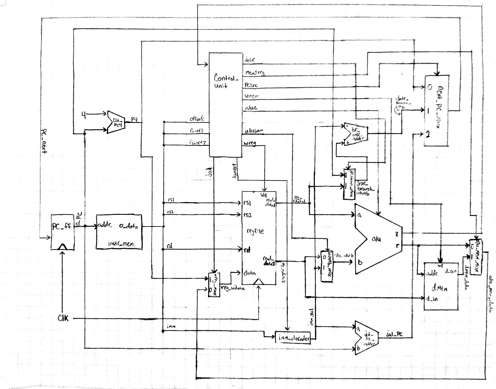

# Single-Cycle-CPU
Simple single-cycle RISC-V CPU

# Directory Structure
<pre>
├── CPU
│   ├── Core
│   │   ├── ALU
│   │   │   ├── add_sub32.v
│   │   │   ├── alu.v
│   │   │   ├── CLA
│   │   │   │   ├── cla_16bit.v
│   │   │   │   ├── cla_32bit.v
│   │   │   │   ├── cla_4bit.v
│   │   │   │   └── cla_8bit.v
│   │   │   └── shifter.v
│   │   ├── control_unit.v
│   │   ├── dff.v
│   │   ├── imm_decode.v
│   │   ├── mux.v
│   │   ├── regfile.v
│   │   └── sc_core.v
│   ├── Data_Mem
│   │   └── data_mem.v
│   ├── Instruction_Mem
│   │   └── instruction_mem.v
│   └── sc_cpu.v
└── Diagrams
    └── cpu.jpg
</pre>

- The CPU directory contains all of the design files, while the Diagrams directory contains the diagrams

# CPU Design

## Instruction Memory
## Data Memory
## Core

- sc_core (single-cycle core) is the main module that contains the control unit, the program counter logic, the ALU, the register file, and the immediate decoder.

### Program Counter
- The program counter (PC) increments by 4 each clock cycle, assuming the instruction is not a branch or jump. The PC increments by 4 since the instruction memory is byte addressable, which means that by incrementing the counter by 4, we increment over 32 bits (the size of one instruction).

### Control Unit
- The control unit is responsible for sending select signals to multiplexers as well as the ALU control signal.
- Signals:
    - Inputs:
        - opcode: The first 7 bits of the instruction
        - funct3: A 3 bit function code that is held in bits 12-14 of the instruction (LUI and Jump instructions do not contain funct3)
        - funct7: A 7 bit function code that is held in bits 25-31 of the instruction (LUI, Jumps, Branches, and Immediates do not contain funct7)
		- zero: The zero flag from the ALU (set to 1 if the output of the ALU is 0)
	- Outputs:
		- jal: Selector signal for data to be written to the register file
		- signext: A signal to determine whether to sign extend the immediate value (If it is an immediate instruction)
		- wreg: The write enbale signal for the register file
		- aluimm: The selector signal for input b of the ALU
			- 0: read_data2 from register file
			- 1: Immediate value
		- aluc: The 4-bit ALU control signal. This signal determines which operation the ALU will execute.
		- wmem: The write enable signal for the data memory
		- pcsrc: The selector signal for the program counter multiplexer
			- 0: PC+4
			- 1: Branch Addr
			- 2: Reg Addr
			- 3: Jump Addr
		- mem2reg: The selector signal for the multiplexer that chooses between the ALU result and the data memory
			- 0: ALU result
			- 1: Data from data memory
		- jalr: The selector signal for the multiplexer for jalr and branch instructions
- Instructions and their respective signal values:
	- add:
		- z = x
		- wreg = 1
		- jal = 0
		- jalr = x
		- mem2reg = 0
		- aluimm = 0
		- signext = x
		- aluc = x000
		- wmem = 0
		- psrc = 00

	- sub:
		- z = x
		- wreg = 1
		- jal = 0
		- jalr = x
		- mem2reg = 0
		- aluimm = 0
		- signext = x
		- aluc = x100
		- wmem = 0
		- psrc = 00

	- and:
		- z = x
		- wreg = 1
		- jal = 0
		- jalr = x
		- mem2reg = 0
		- aluimm = 0
		- signext = x
		- aluc = x001
		- wmem = 0
		- psrc = 00

	- or:
		- z = x
		- wreg = 1
		- jal = 0
		- jalr = x
		- mem2reg = 0
		- aluimm = 0
		- signext = x
		- aluc = x101
		- wmem = 0
		- psrc = 00

	- xor:
		- z = x
		- wreg = 1
		- jal = 0
		- jalr = x
		- mem2reg = 0
		- aluimm = 0
		- signext = x
		- aluc = x010
		- wmem = 0
		- psrc = 00

	- addi:
		- z = x
		- wreg = 1
		- jal = 0
		- jalr = x
		- mem2reg = 0
		- aluimm = 1
		- signext = 0
		- aluc = x000
		- wmem = 0
		- psrc = 00

	- andi:
		- z = x
		- wreg = 1
		- jal = 0
		- jalr = x
		- mem2reg = 0
		- aluimm = 1
		- signext = 0
		- aluc = x001
		- wmem = 0
		- psrc = 00

	- ori:
		- z = x
		- wreg = 1
		- jal = 0
		- jalr = x
		- mem2reg = 0
		- aluimm = 1
		- signext = 0
		- aluc = x101
		- wmem = 0
		- psrc = 00

	- xori:
		- z = x
		- wreg = 1
		- jal = 0
		- jalr = x
		- mem2reg = 0
		- aluimm = 1
		- signext = 0
		- aluc = x010
		- wmem = 0
		- psrc = 00

	- slli:
		- z = x
		- wreg = 1
		- jal = 0
		- jalr = x
		- mem2reg = 0
		- aluimm = 1
		- signext = x
		- aluc = 0011
		- wmem = 0
		- psrc = 00

	- srli:
		- z = x
		- wreg = 1
		- jal = 0
		- jalr = x
		- mem2reg = 0
		- aluimm = 1
		- signext = x
		- aluc = 0111
		- wmem = 0
		- psrc = 00

	- srai:
		- z = x
		- wreg = 1
		- jal = 0
		- jalr = x
		- mem2reg = 0
		- aluimm = 1
		- signext = x
		- aluc = 1111
		- wmem = 0
		- psrc = 00

	- lw:
		- z = x
		- wreg = 1
		- jal = 0
		- jalr = x
		- mem2reg = 1
		- aluimm = 1
		- signext = 1
		- aluc = x000
		- wmem = 0
		- psrc = 00

	- sw:
		- z = x
		- wreg = 0
		- jal = x
		- jalr = x
		- mem2reg = x
		- aluimm = 1
		- signext = 1
		- aluc = x000
		- wmem = 1
		- psrc = 00

	- beq:
		- z = 0/1
		- wreg = 0
		- jal = x
		- jalr = 0
		- mem2reg = x
		- aluimm = 0
		- signext = 1
		- aluc = x010
		- wmem = 0
		- psrc = z

	- bne:
		- z = 0/1
		- wreg = 0
		- jal = x
		- jalr = 0
		- mem2reg = x
		- aluimm = 0
		- signext = 1
		- aluc = x010
		- wmem = 0
		- psrc = ~z

	- lui:
		- z = x
		- wreg = 1
		- jal = 0
		- jalr = x
		- mem2reg = 0
		- aluimm = 1
		- signext = x
		- aluc = x110
		- wmem = 0
		- psrc = 00

	- jalr:
		- z = x
		- wreg = 1
		- jal = 1
		- jalr = 1
		- mem2reg = x
		- shift = 0
		- aluimm = 1
		- signext = x
		- aluc =  xxxx
		- wmem = 0
		- psrc = 01

	- jal:
		- z = x
		- wreg = 1
		- jal = 1
		- jalr = 0
		- mem2reg = x
		- aluimm = x
		- signext = x
		- aluc = xxxx
		- wmem = 0
		- psrc = 10

### Register File
- Inputs:
	- rs1: Register source 1. Held in bits 15-19 of instruction
	- rs2: Register source 2. Held in bits 20-24 of instruction
	- rd: Register destination. Held in bits 7-11 of instruction
	- data: Data to be written (if applicable)
	- we: write enable signal from control unit
- Outputs:
	- read_data1: 23-bit read data
	- read_data2: 32-bit read data

### ALU

### Immediate Decoder

